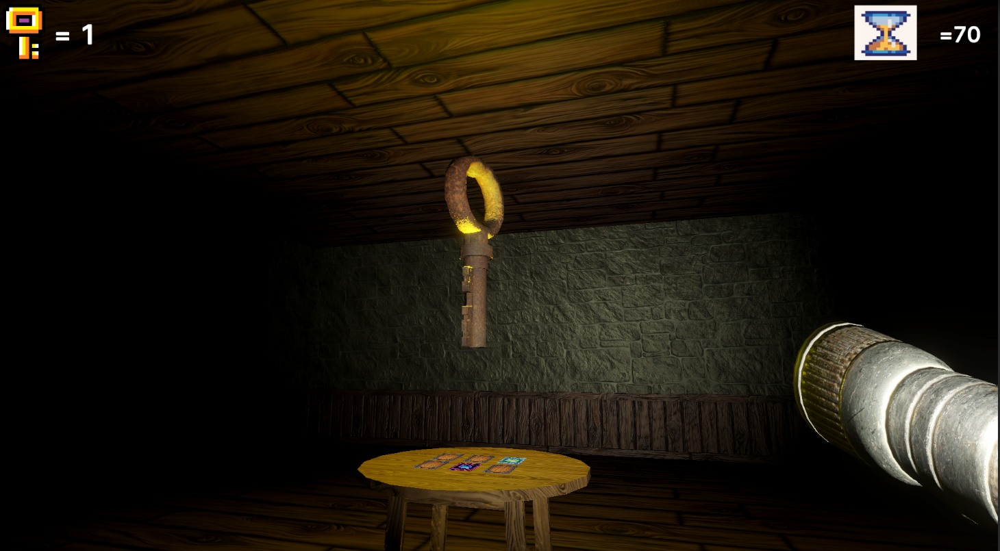
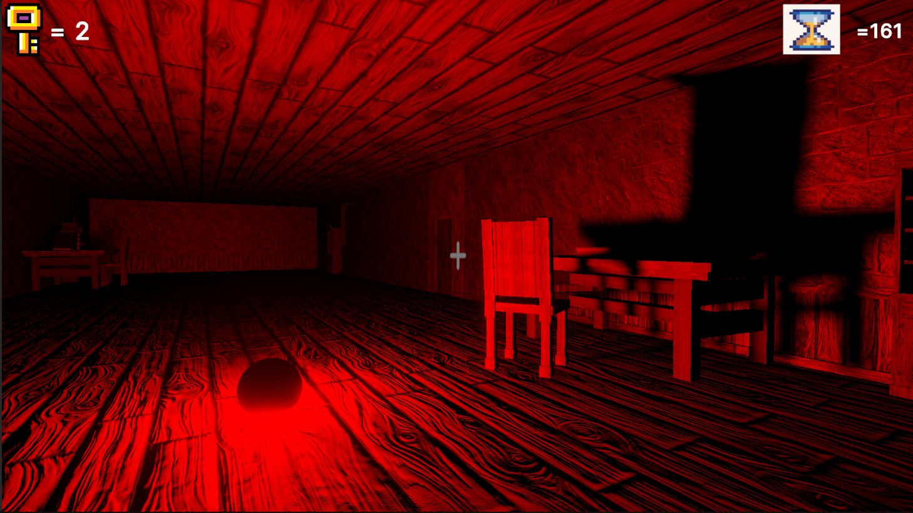
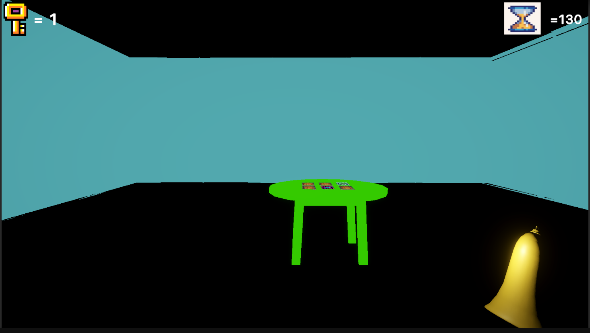
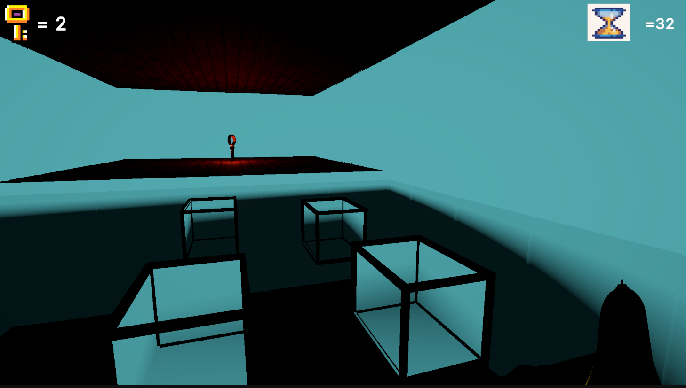
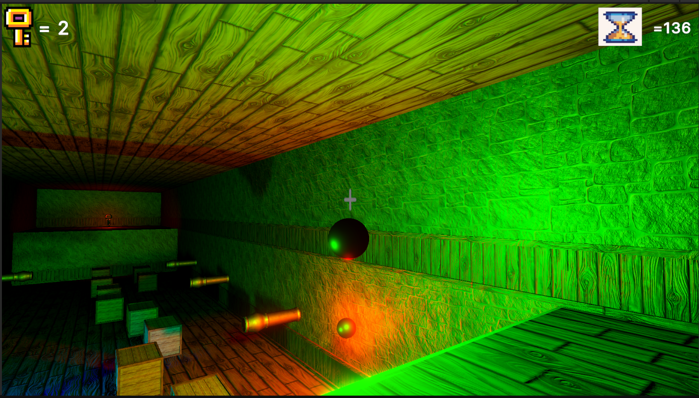
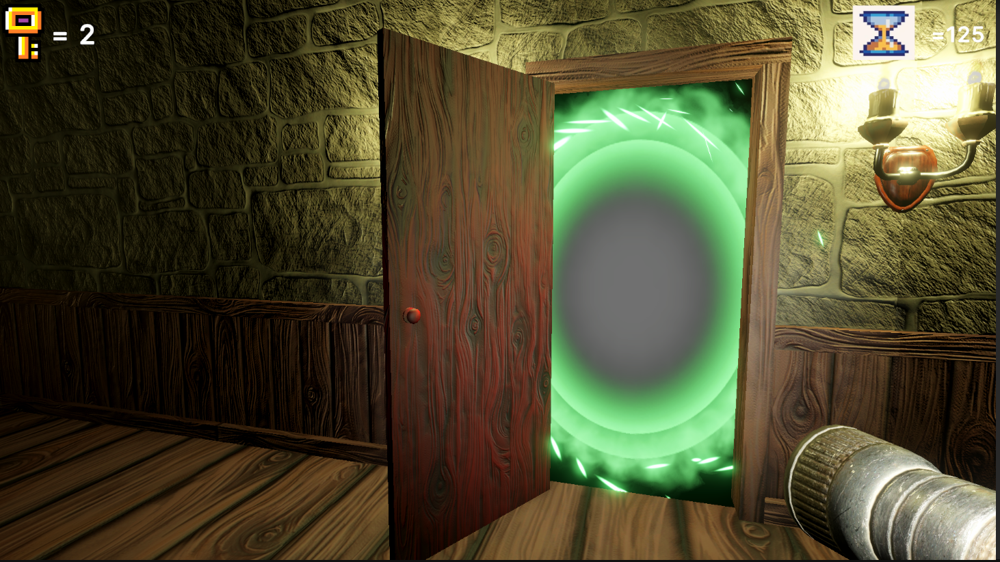

# 🕯️ Escape The Darkness

**3D Escape Room Game** – Developed for the Game Development University Exam

---

### 🎮 Overview
Escape-The-Dungeon is a dark and atmospheric 3D escape room game featuring:

- 🧩 **Random map generation**
- 🧲 **Physics-based puzzles and mini-games**
- 🕵️‍♀️ **Three playable characters**, each with unique lighting abilities to explore the dungeon in complete darkness

> **Your mission:** Escape the dungeon before it traps you forever.

---

### 🖼️ Screenshots

#### 🧱 Basic Elements

- FlashLight Character  
   
  

- Character with Balls  
   
  

- Echo Character  
   
  

- Echo In Water Room  
   
  

- Empty Water Room  
   
  

#### 🎬 Ending

- The End  
   
  

---

### 🚀 Try the Game

Playable on **Mac (Apple Silicon)** and **Windows**.

📦 [Download & Development Info](https://drive.google.com/drive/folders/1erUmX34KVED94jPAI2y2jboKP1-At1aX)

---

### ⚙️ Development Notes

- 🧱 Built with Unity Engine

### 💬 Feedback

If you try the game, feel free to open an issue or leave a comment — we’d love to hear your thoughts!

---
